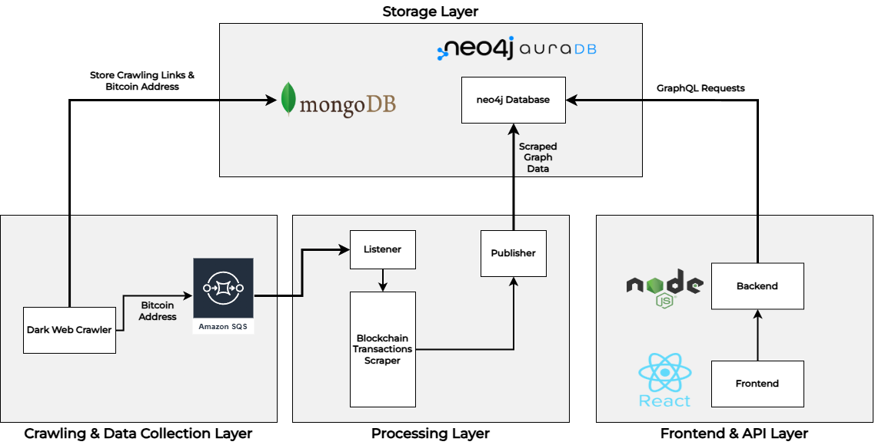

# Dark Web Bitcoin Crawling and Visualization

A full-stack system that extracts Bitcoin addresses from the dark web, analyzes blockchain transactions, and visualizes them using an interactive graph. The project is designed to assist in tracking illicit cryptocurrency transactions, making it useful for law enforcement and blockchain analysts.

# System Architecture

## 1. Crawling & Data Collection Layer

- **Dark Web Crawler**: Uses Tor, Selenium, and BeautifulSoup to scrape .onion sites and extract Bitcoin addresses.
- **Amazon SQS**: A queueing service that temporarily holds the Bitcoin addresses collected by the crawler before they are processed.
- **MongoDB**: Stores the raw crawling data, including links and extracted Bitcoin addresses.

## 2. Processing Layer

- **Listener**: Retrieves Bitcoin addresses from Amazon SQS.
- **Blockchain Transactions Scraper**: Fetches transaction history from the Bitcoin ledger for collected addresses.
- **Publisher**: Structures the scraped data and stores it in a Neo4j database, representing transactions as a graph.

## 3. Storage Layer

- **MongoDB**: Stores raw data obtained from crawling the dark web, including extracted Bitcoin addresses and metadata.
- **Neo4j AuraDB**: Graph database that efficiently stores and queries Bitcoin transactions as a connected network.

## 4. Frontend & API Layer

- **Neo4j AuraDB**: Stores transaction relationships in a graph format for efficient querying.
- **Backend (Node.js + Apollo GraphQL)**: Acts as a middleware, allowing the frontend to fetch transaction data using GraphQL queries.
- **Frontend (React + Vis.js)**: Provides an interactive interface to visualize Bitcoin transactions and their movement between addresses.

# Features

1. **Automated Dark Web Crawler** – Extracts Bitcoin addresses from .onion sites.
1. **Real-Time Transaction Scraping** – Fetches blockchain transactions related to collected addresses.
1. **Graph-Based Visualization** – Displays Bitcoin transaction flows using React, Vis.js, and Apollo GraphQL.
1. **Scalable Processing Architecture** – Uses Amazon SQS to queue addresses before scraping transactions.
1. **Graph Database (Neo4j)** – Efficiently stores and queries Bitcoin transactions as a connected graph.

# Tech Stack

## Backend & Database

- **Node.js + Apollo GraphQL** – Handles GraphQL API to query transactions.
- **Neo4j AuraDB** – Graph database for storing Bitcoin transactions.
- **MongoDB** – Stores extracted Bitcoin addresses and raw crawling data.
- **Docker** – Containerized deployment of backend services.
- **Amazon SQS** – Manages queues of Bitcoin addresses for processing.

## Frontend

- **React + Vite** – Frontend for displaying transaction graphs.
- **Vis.js** – Graph visualization for Bitcoin transactions.
- **Apollo Client** – Fetches GraphQL data from the backend.

## Crawling & Scraping

- **Tor + Geckodriver** – Dark web crawler for extracting Bitcoin addresses.
- **Selenium** – Parses extracted HTML data.
- **Bitcoin Ledger API** – Fetches transaction details on the blockchain.

---

## Future Improvements

- Expand support for Ethereum and other cryptocurrencies.  
- Integrate Machine Learning to detect suspicious transactions.  
- Implement alerts for flagged or high-risk transactions.

### The Graph Displays:

- **Nodes**: Bitcoin wallet addresses.
- **Edges**: Transactions between addresses.
